# ワークショップ参加者向け操作手順書

このドキュメントは、HelpDesk Motor Company FAQ 刷新ワークショップに参加する方が、2 時間のハンズオンを迷わず進められるようにまとめた手順書です。GUI 操作が中心ですが、必要に応じて CLI 補足資料（`docs/cli-cheatsheet.md`）も参照できます。

---

## 0. 事前チェック（開始 10 分前まで）

1. **環境を確保する**
   - GitHub Desktop / VS Code / Copilot 拡張をインストール済みか確認。
   
   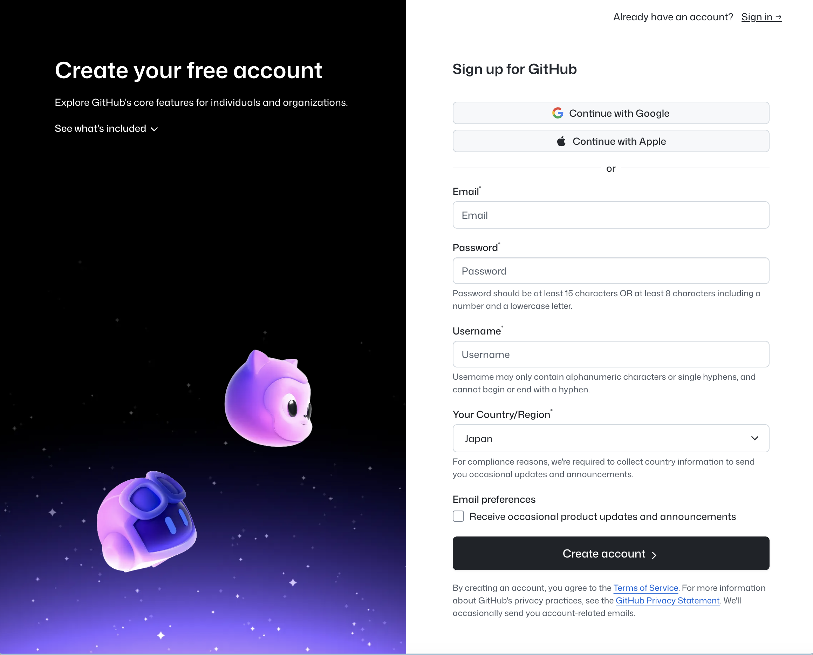
   
2. **リポジトリをフォーク**
   - ブラウザで `https://github.com/yoshioterada/GitHub-Workshop-4-Beginners` を開き、右上の **Fork** をクリック。
   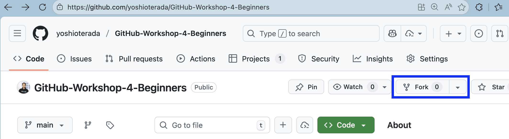
   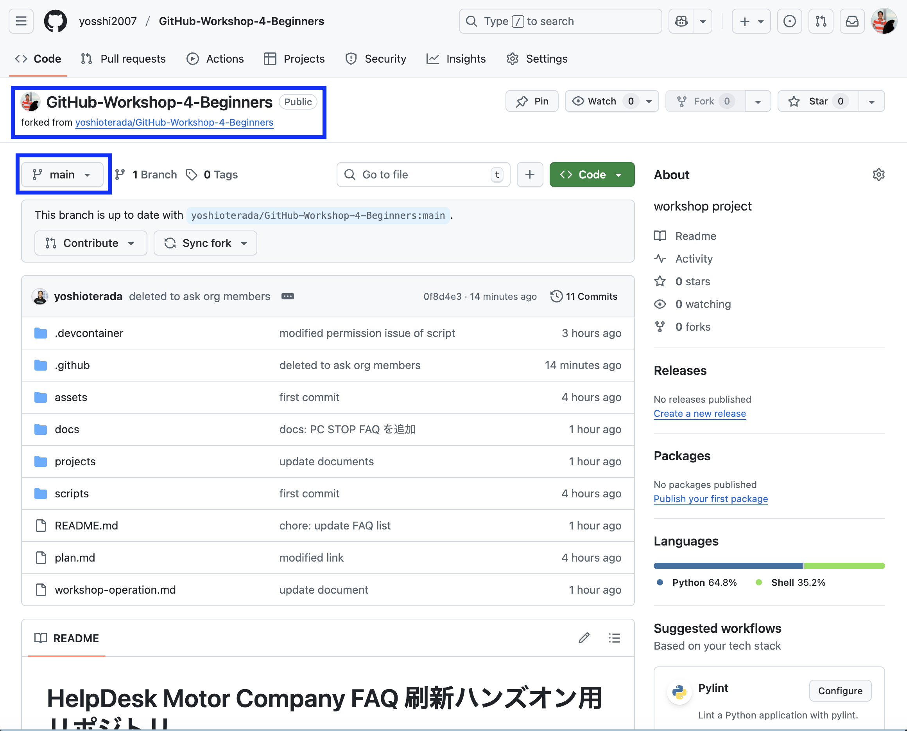
3. **クローン or Codespaces 起動**
   - GitHub Desktop: `Code > Open with GitHub Desktop` を押し、ローカルへ clone。
   - Codespaces を使う場合は `docs/codespaces-guide.md` の手順で「Create codespace on main」。
   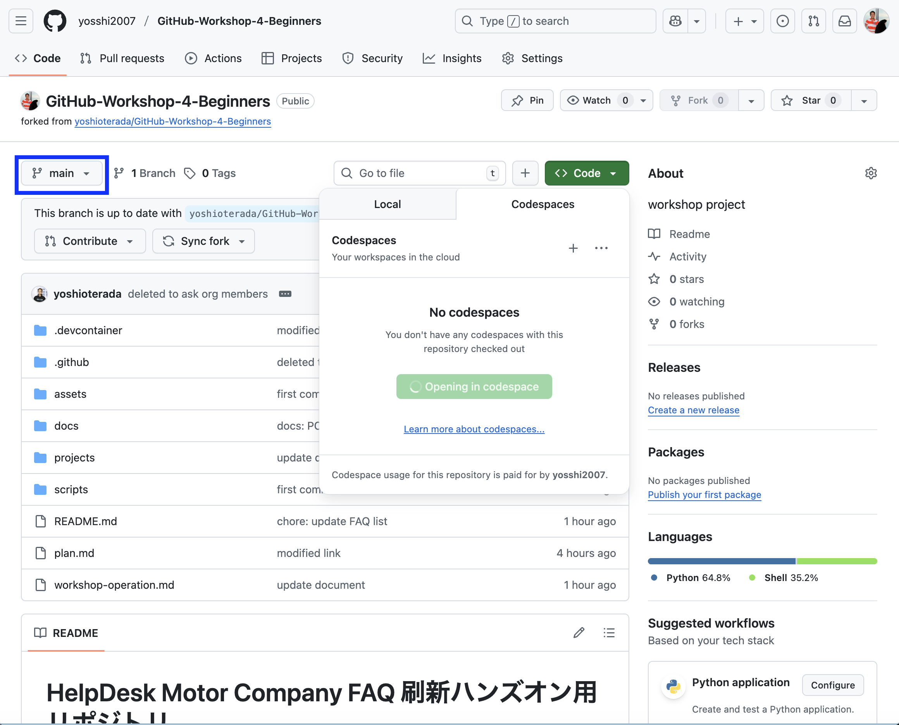
   - CLI: `git clone https://github.com/<your-account>/helpdesk-faq-sample.git` でローカルに複製し、`cd helpdesk-faq-sample` で移動。
4. **ブランチ状況を確認**
   - GitHub Desktop 左上 `Current Branch` が `main` になっているか確認し、`Fetch origin` で最新化。
   - CLI: `git fetch origin && git status -sb` を実行し、`## main` と表示されれば OK。

---

## 1. Issue を作成する（約 15 分）

### Issues が Enable になっていない場合

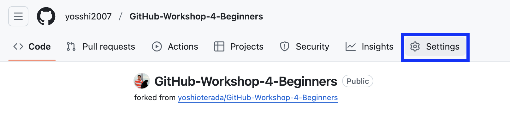
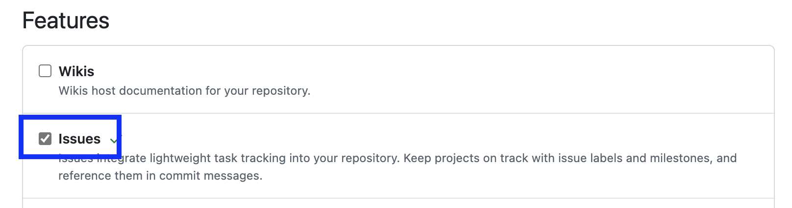
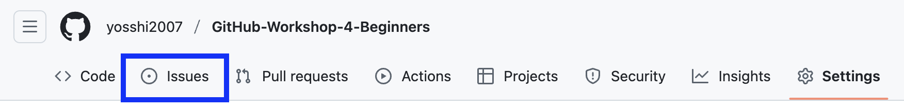

### Issue の作成

1. **Issue テンプレートを開く**
   - リポジトリ画面 → `Issues > New issue` → `Helpdesk Ticket` を選択。
   - CLI (任意): GitHub CLI が使える場合は `gh issue create --template "helpdesk-ticket.yml" --title "[FAQ] ..." --body-file assets/snippets/template.md` のように実行しても OK。
   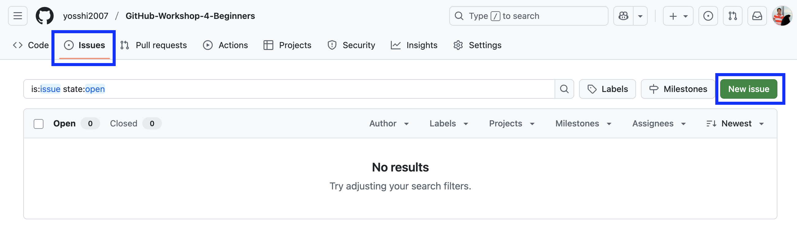
   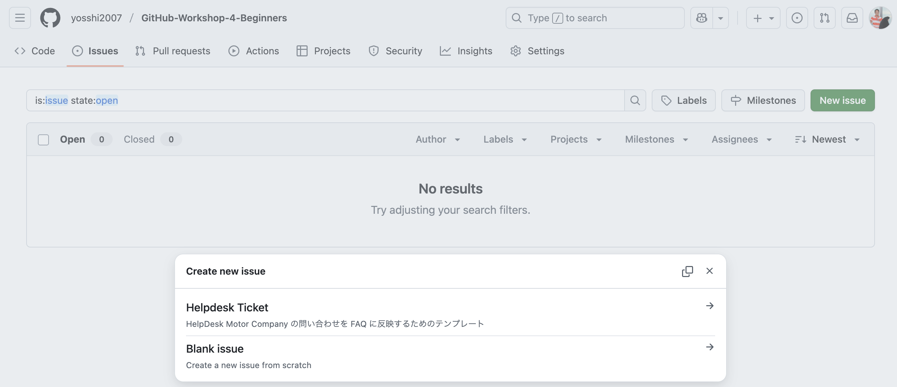
2. **テンプレートを埋める**
   - タイトル: 例 `WiFi に接続をしようとしても認証画面が表示されず接続できない`
   - 再現手順: 時系列で 3 行以上を書く。
   - 期待する結果: どんな FAQ があれば解決しそうかを書く。
   - SLA と添付リンク欄も必ず入力。
   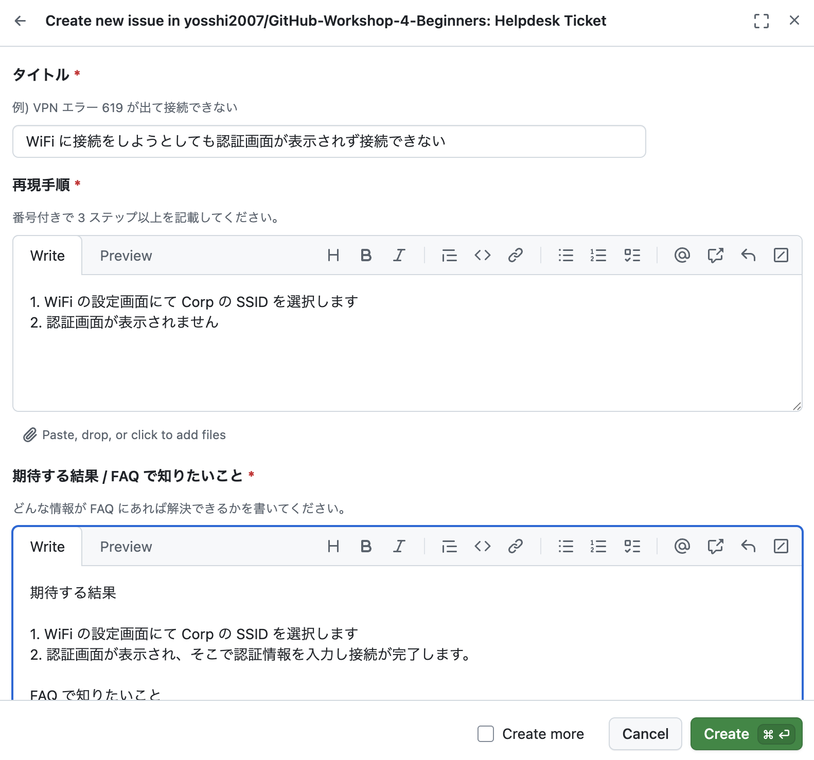
   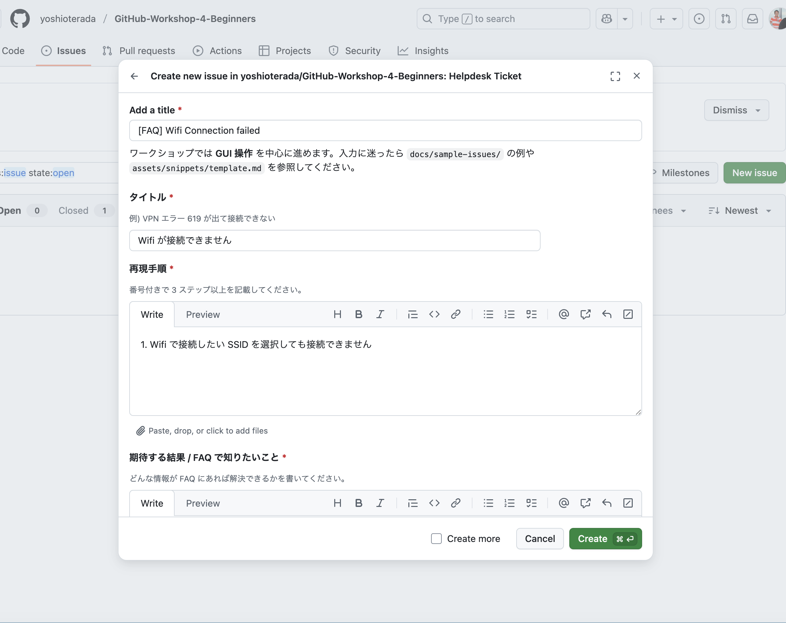
3. **Projects へ自動連携する**
   - Issue 作成後、右側の `Projects` で `HelpDesk Refresh Board` を選択。
   - 既定で「未着手」にカードが作られるので、担当列を確認。
   - フォーク先などでボードが一覧に出ない場合は、自身のアカウントか組織で新しい Project を作成し（`Projects > New project`）、`projects/helpdesk-refresh.json` の列構成を参考に「未着手 / 作業中 / レビュー / 公開済み」を手動で用意してください。主催者が共有したプロジェクトに参加する権限がないと表示されません。
   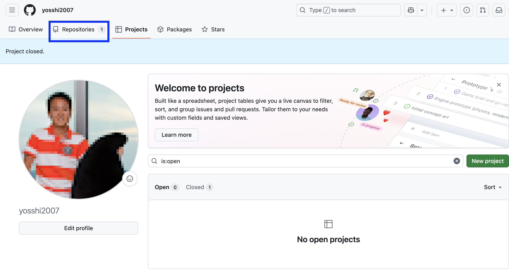
   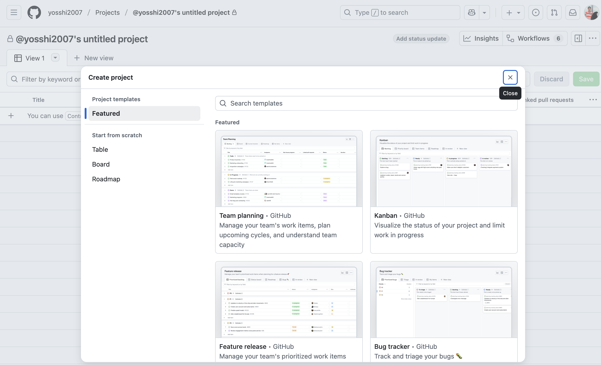
   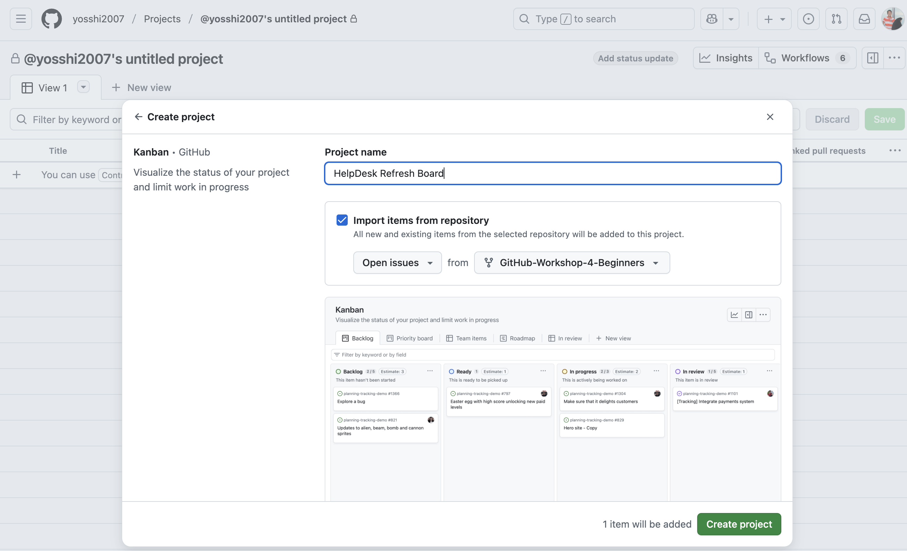

> メモ: サンプルは `docs/sample-issues/issue-101-vpn.md` を参照してください。テンプレートの定義は `.github/ISSUE_TEMPLATE/helpdesk-ticket.yml` にあります。

---

## 2. ブランチを作り作業を開始（約 15 分）

### 2.1 Issue からブランチを作成

- **GUI**: Issue 画面右ペインの `Development` から `Create branch` のリンクをクリックし `issue-<番号>-短い説明` の形式で作成。
- **CLI**: `git fetch origin` 後に `git switch -c issue-<番号>-短い説明 origin/main`。フォークで main 名が異なる場合は `origin/main` を適宜変更。

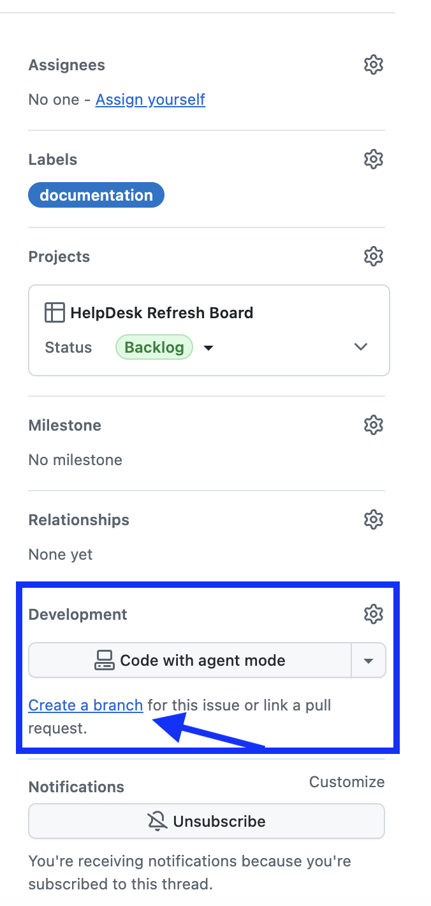
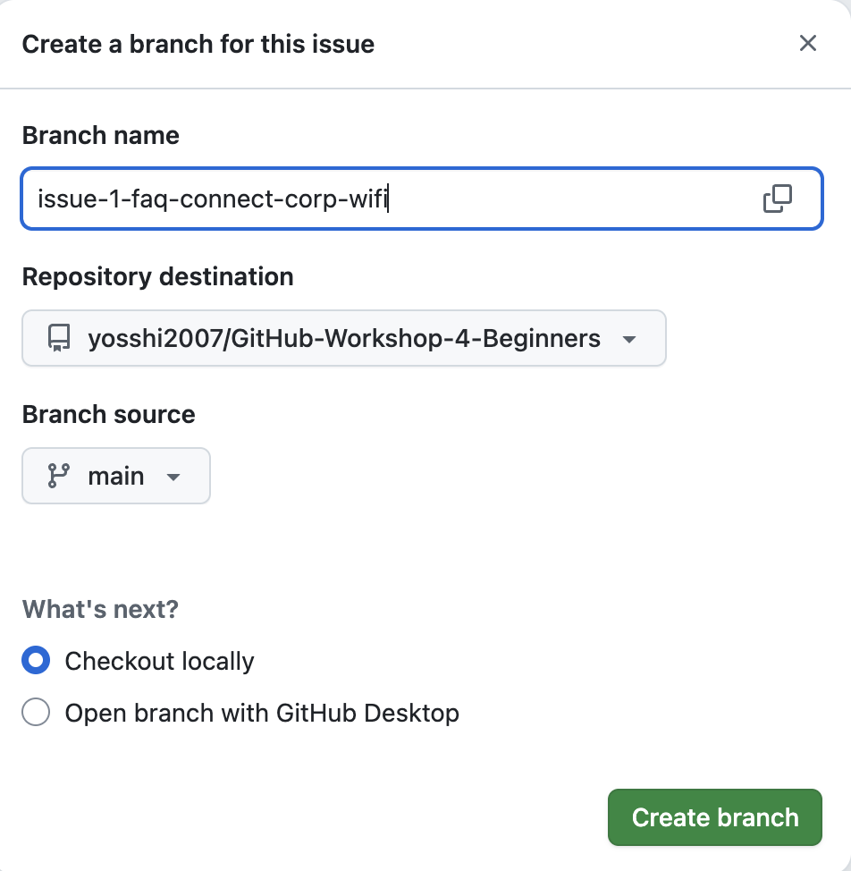

### 2.2 ブランチの切り替え

- **GitHub Desktop**: 左上の `Current Branch` → 作成したブランチを選択。通知に出る `Switch to branch` をクリックしても OK。
- **Codespaces / VS Code**: 左下のブランチ名をクリック → 一覧から作成済みブランチを選択。Command Palette（`Cmd/Ctrl + Shift + P`）で `Git: Checkout to...` を実行しても切り替え可能。
- **CLI**: `git switch issue-<番号>-短い説明`（古いバージョンなら `git checkout issue-<番号>-短い説明`）。現在のブランチは `git status -sb` で確認。
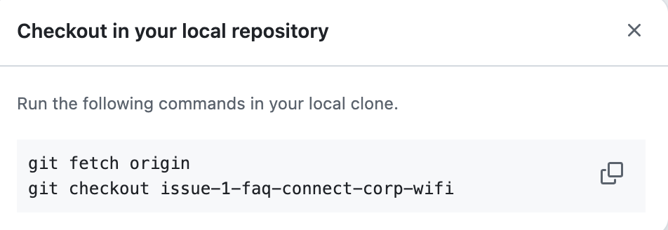

### 2.3 Local もしくは Codespaces で VS Code を開く

- **GitHub Desktop**: `Open in Visual Studio Code` で対象ファイルへ移動。
- **CLI**: VS Code を使うなら `code .` や `code docs/faq/wifi-connection-fail.md`。Vim 等のエディタ派は `vim docs/faq/wifi-connection-fail.md` など好みのツールを使用。
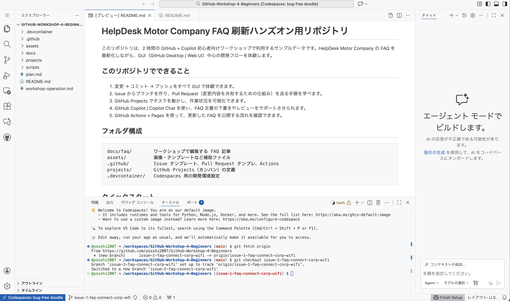

### 2.4 新しい FAQ ドキュメント・ファイルを作成

- 例: `docs/faq/wifi-connection-fail.md` の「解決ステップ」に手順を追記。
- 画像が必要なら `assets/images/` の SVG を再利用。
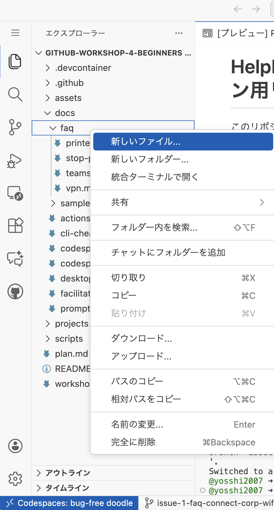

### 2.5 GitHub Copilot Agent Mode でドキュメント編集

GitHub Copilot を利用できるようにし、Copilot でドキュメントを編集する。
まず、GitHub Copilot を利用できるように設定。

「Premium モデルの追加」をクリック
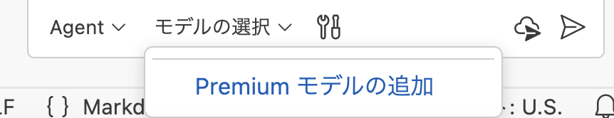  
「Use AI Feature」のボタンをクリック
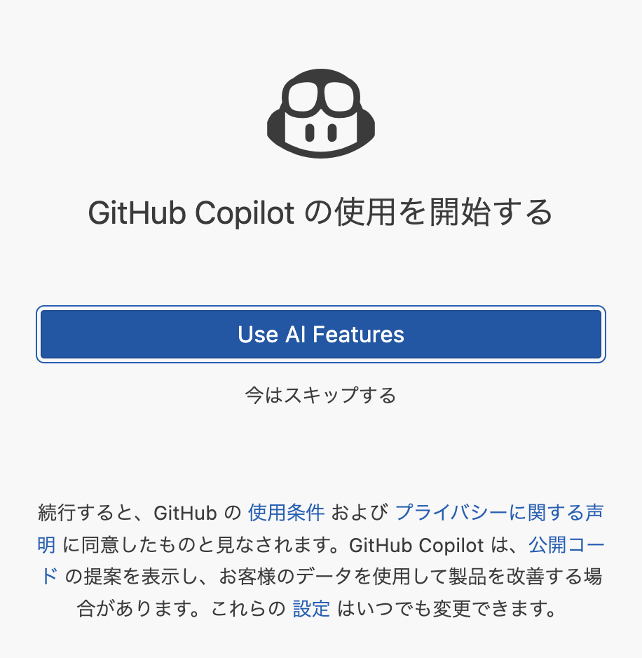  
「モデルの管理... Add Premium Models」でモデルを選択。例：`GPT-4.1`
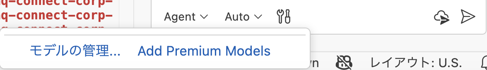  

GitHubの Agent Mode を利用して、AI によるドキュメント作成

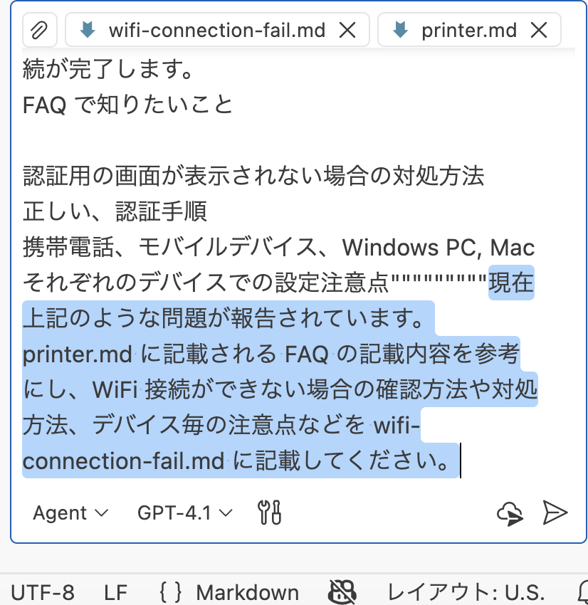

## 3. 変更をコミットしてプッシュ（約 10 分）

1. **変更を確認**
   - GitHub Desktop の `Changes` タブで差分を見る。
   - 余計なファイルが含まれていないかチェック。
   - CLI: `git status` で変更ファイル一覧、`git diff` で差分を確認。特定ファイルのみ見たいときは `git diff docs/faq/wifi-connection-fail.md` のようにパスを指定。
   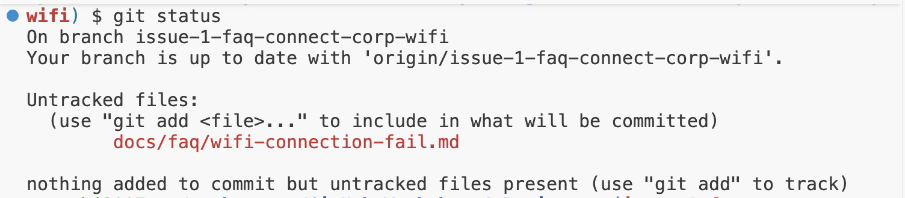
   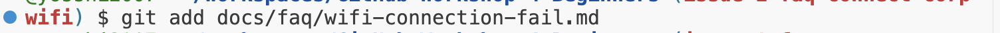
2. **コミットメッセージを書く**
   - `Summary`: `docs: WiFi Connection Fail checker`
   - `Description`: 変更理由や Issue 番号（例: `Refs #1`）。
   - CLI: `git add docs/faq/wifi-connection-fail.md` など必要なファイルをステージし、`git commit -m "docs: WiFi Connection Fail checker" -m "Refs #1"` を実行。
   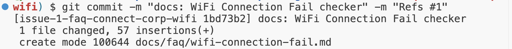
3. **コミット & プッシュ**
   - `Commit to <branch>` → `Push origin` の順。
   - CLI: `git push origin issue-<番号>-短い説明`。初回は `git push -u origin issue-<番号>-短い説明` で upstream を設定。
   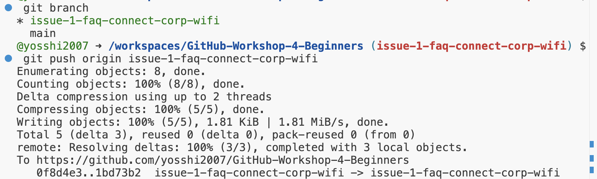

## 4. Pull Request を作成（約 15 分）

1. **PR を作る**
   - Push 後に表示される `Create Pull Request` を押すか、GitHub 上の `Compare & pull request` をクリック。
   - CLI: `gh pr create --fill --head issue-<番号>-短い説明` を実行。テンプレートが自動で差し込まれ、ブラウザなしで PR を作成可能。
   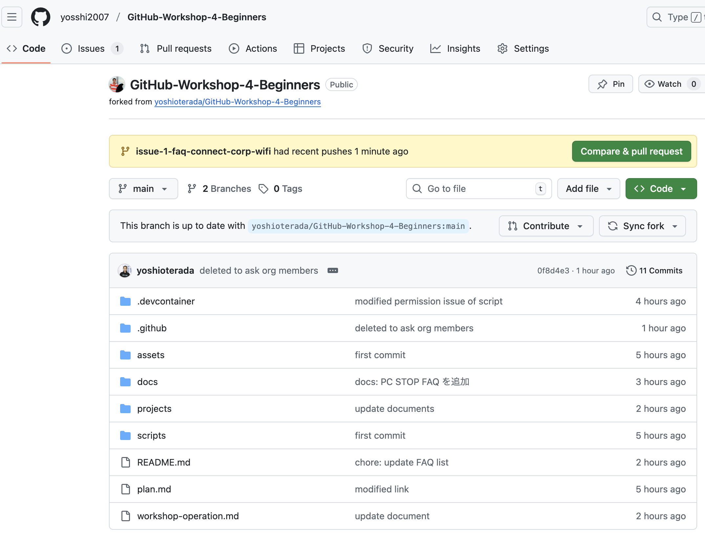
2. **テンプレートを埋める**
   - 背景: どの Issue を解決するか（例: `Fixes #1`）。
   - 変更内容: 箇条書きで 2 行以上。
   - 確認方法: どうやって結果をチェックしたか（例: `docs/faq/wifi-connection-fail.md をプレビューで確認`）。
   - テンプレート本文は `.github/pull_request_template.md` にあるので、フォーマット確認やカスタマイズ時に参照してください。
   - CLI: `gh pr edit --body-file .github/pull_request_template.md` でテンプレートを読み込み、VS Code 等で編集後に保存して反映。
   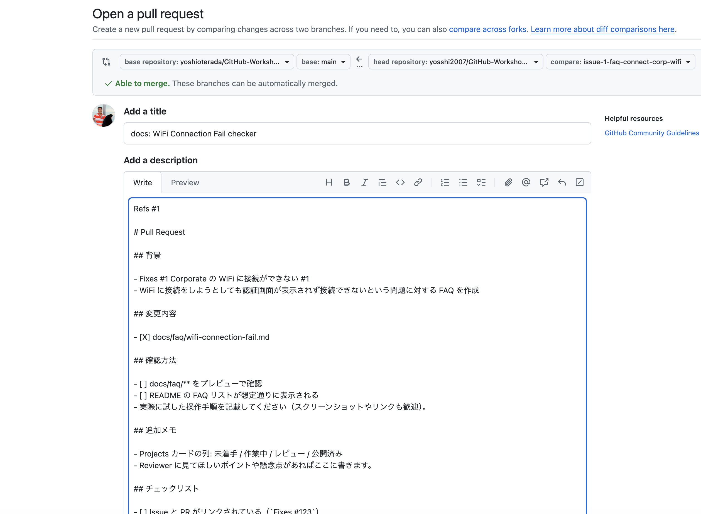
   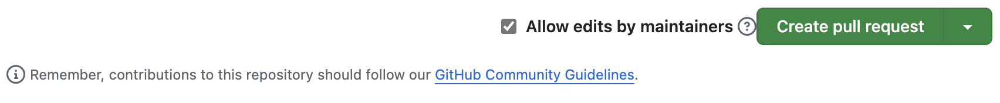
3. **Projects カードを移動**
   - PR 作成後、Projects のカードを「レビュー」列にドラッグ。
   - CLI: `gh project item-move --project-id <プロジェクトID> --item-id $(gh pr view --json id --jq '.id') --column-name "レビュー"` で列移動も可能（`project-id` や `item-id` は `gh project item list` などで取得）。
   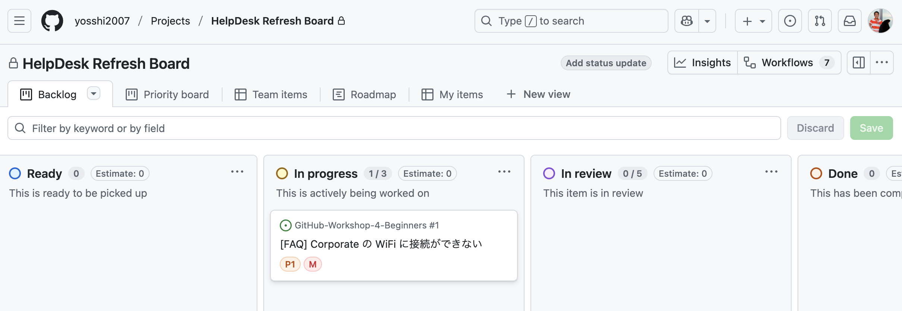

## 5. レビュー & Copilot の活用（約 20 分）

1. **レビューコメントの確認**
   - CopilotからのReviewコメントに返信。`Apply suggestion` で取り込み可能。
   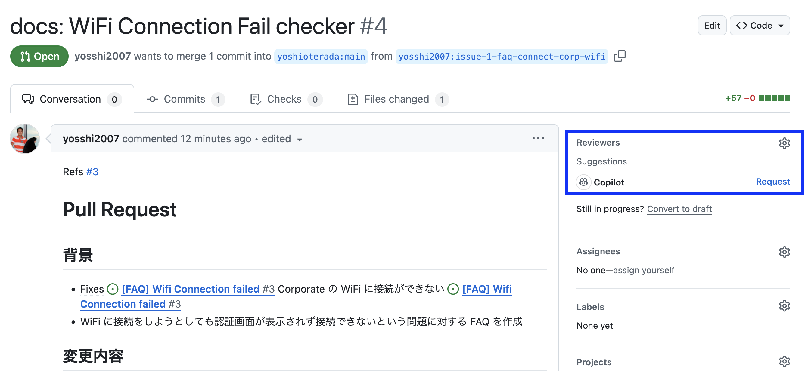
   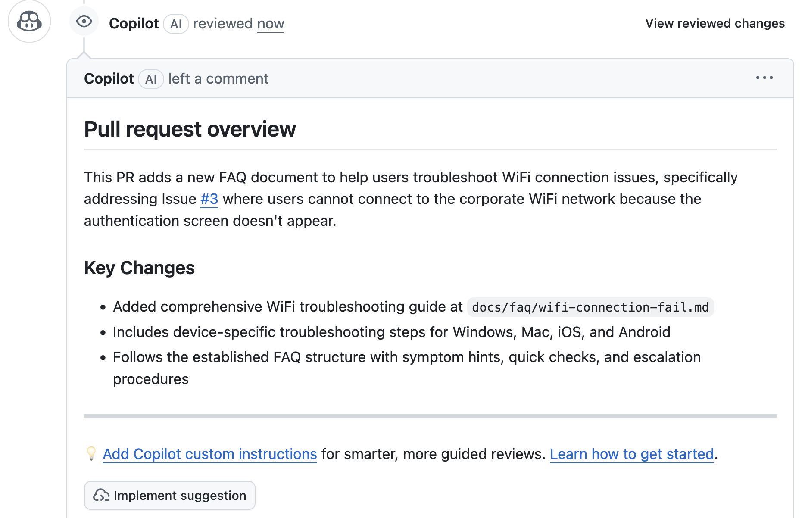
   - CLI: `gh pr view --comments` でコメントを一覧し、`gh pr checkout <番号>` でローカルに取り込んで修正。
2. **修正があれば再コミット**
   - 同じブランチで修正 → コミット → プッシュすると PR に差分が追加される。
   - CLI: `git commit --amend` で直前のコミットを更新したり、`git commit` → `git push` で追コミットを送信。
   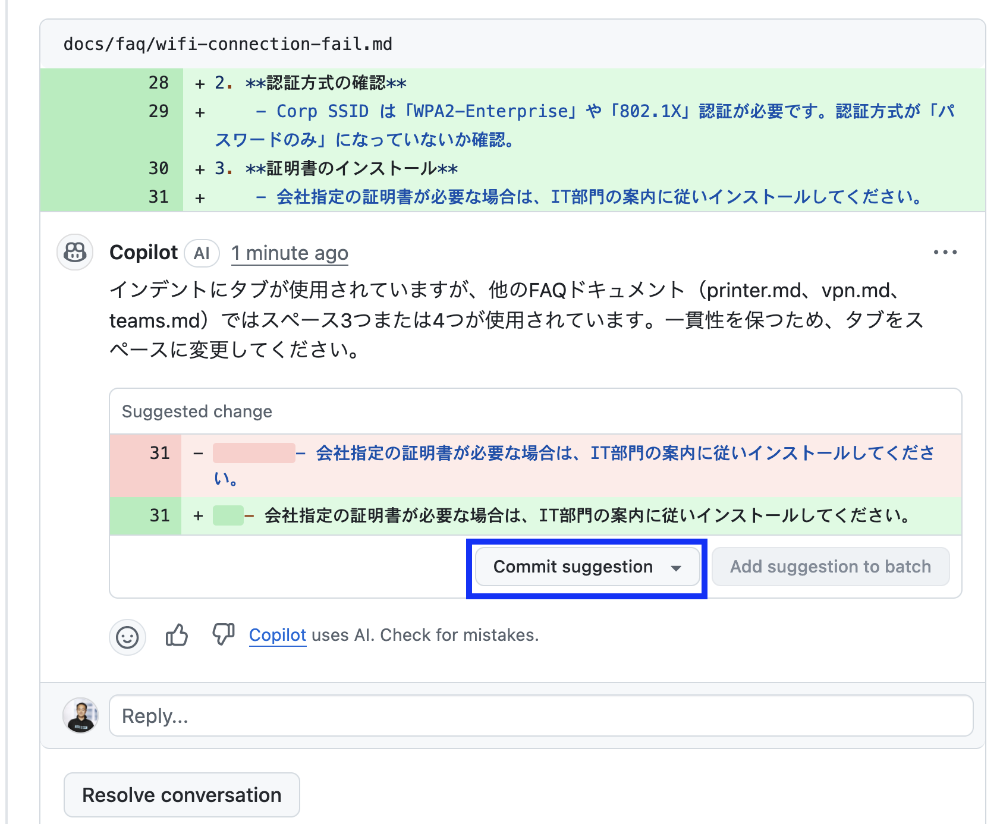
3. **承認後にマージ**
   - `Merge pull request` → `Confirm merge` を押し、`Delete branch` で後片付け。
   - CLI: `gh pr merge --merge --delete-branch --auto` でブラウザを開かずにマージし、リモートブランチも削除。
   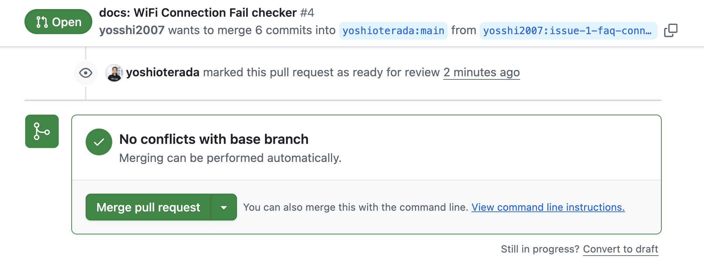
   

## 6. マージ後の確認（約 10 分）

1. **README の FAQ リスト更新**
   - GitHub Actions `Update README` が成功しているか `Actions` タブで確認。
   - CLI: `gh run list --workflow "Update README" --limit 1` で直近の結果を確認し、詳細を見たいときは `gh run watch <run-id>`。
   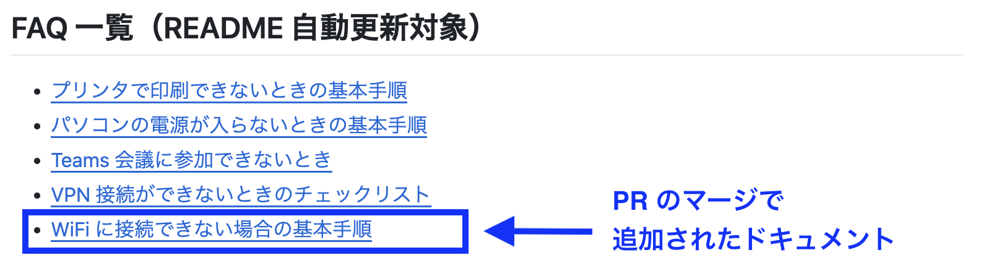
2. **GitHub Pages / 公開ページ**
   - 当日用サイトがある場合、FAQ が反映されたか確認。
   - CLI: `gh repo view --web` でページを開くか、`gh api repos/:owner/:repo/pages/builds` でビルド状況を確認。
3. **Projects を「公開済み」へ移動**
   - カードをドラッグし、Issue を close。
   - CLI: `gh project item-move --project-id <プロジェクトID> --item-id <Issueのitem-id> --column-name "公開済み"`、`gh issue close <番号>` で同じ操作を完結。

---

## 7. トラブルシュート早見表

| 症状 | 対処 |
| --- | --- |
| ブランチが見つからない | GitHub Desktop で `Fetch origin` → `Branch > Checkout` から再検索。 |
| Push が拒否される | `Fetch origin` 後に `Branch > Merge into Current Branch...` で main を取り込んでから再 Push。 |
| Actions が失敗した | `Actions > Update README` を開き、ログのエラー箇所を確認。必要なら `Run workflow` で再実行。 |
| Copilot が応答しない | VS Code 左下のアカウント状態を確認し、再サインイン。Codespaces の場合は `Help > Sign in with GitHub`。 |

---

## 8. セッション中のゴール確認ポイント

- ✅ Issue を事前に用意したテンプレートを利用して作成できたか
- ✅ Projects カードを「未着手 → 作業中 → レビュー → 公開済み」と動かせたか
- ✅ GUI/CLI でコミット / PR / マージが完了したか
- ✅ Copilot Agent/Agent Review の機能を 1 回は試したか

この手順書を手元に置き、困ったときは `docs/desktop-guide.md` や `docs/prompts.md`、`docs/cli-cheatsheet.md` とあわせて参照してください。分からない場合はメンターへ気軽に質問しましょう。
